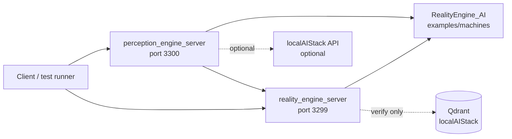
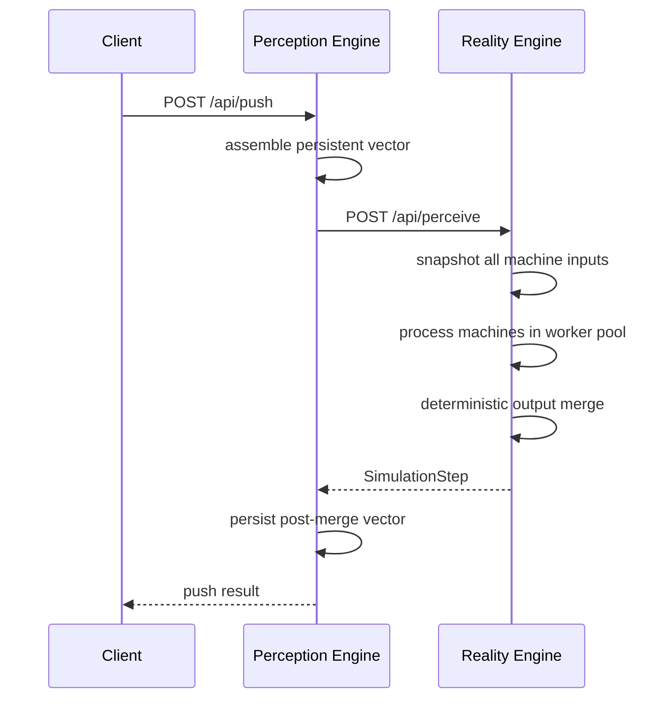

# RealityEngine_CPP Architecture

RealityEngine_CPP is the native C++ implementation of the Reality Engine and
Perception Engine services. It follows the behavior of `RealityEngine_AI` while
using Boost.Asio/Beast for HTTP transport.

## Service Map

## Core Class Mapping

| RealityEngine_AI concept | C++ class | Responsibility |
| --- | --- | --- |
| `RealityVector` | `reality::RealityVector` | Comparator matching and output assertions. |
| `CriticalEventSequence` | `reality::CriticalEventSequence` | Deferred activation over active graph nodes. |
| `OutputArbiter` | `reality::OutputArbiter` | `AND`, `OR`, and `PASSTHROUGH` output decisions. |
| `Machine` | `reality::Machine` | Runs CES graphs and emits machine transition results. |
| `PreceptionEngine` | `reality::PreceptionEngine` | Extracts machine input and merges machine output. |
| `PerceptualSpaceSimulator` | `reality::PerceptualSpaceSimulator` | Snapshot -> process -> deterministic merge loop. |
| Perception Engine | `reality::PerceptionEngine` | Builds persistent vectors from test, simulated, and sensor sources. |

## Request Flow

## Runtime Guarantees

| Area | Current rule |
| --- | --- |
| Perceptual dimension | `VECTOR_DIMENSION` is a dense compatibility floor; runtime logic should derive required size from active mappings. |
| Machine loading | `start.sh` loads JSON machines from `../RealityEngine_AI/examples/machines`. |
| RE process cycle | Input-atomic snapshot, parallel machine processing, deterministic merge. |
| PE push cycle | Single-flight push; concurrent push attempts return `409` or queue saturation `429`. |
| HTTP transport | Boost.Asio/Beast server and client with keep-alive, timeouts, and bounded workers. |
| Qdrant | Shared localAIStack dependency; verified but not owned or mutated by this repo. |
| localAIStack | Optional bridge through PE sensor sources and guarded integration endpoints. |

## Repository Layout

| Path | Purpose |
| --- | --- |
| `include/reality/` | Public C++ headers. |
| `src/reality.cpp` | Core domain model, simulator, source model, machine loader. |
| `src/http.cpp` | Boost.Asio/Beast transport implementation. |
| `src/reality_engine_server.cpp` | Native Reality Engine API service. |
| `src/perception_engine_server.cpp` | Native Perception Engine API service. |
| `tests/` | Unit, corpus, domain, and service-boundary validation. |
| `docs/openapi/` | OpenAPI contracts for native services. |

## Validation Map

| Command | Validates |
| --- | --- |
| `make test` | Core C++ behavior. |
| `make e2e-corpus` | All authored machine `inputSequences` from the AI repo corpus. |
| `make e2e` | Corpus tests plus PE -> RE service-boundary stream propagation. |

## Related Docs

| Need | Document |
| --- | --- |
| Documentation index | [README.md](README.md) |
| API parity | [API_EQUIVALENCE.md](API_EQUIVALENCE.md) |
| Vector model | [VECTOR_MANAGEMENT.md](VECTOR_MANAGEMENT.md) |
| Operations | [OPERATIONS.md](OPERATIONS.md) |
| Local AI bridge | [LOCAL_AI_INTEGRATION.md](LOCAL_AI_INTEGRATION.md) |
| Acronyms | [ACRONYMS.md](ACRONYMS.md) |
| Bibliography | [BIBLIOGRAPHY.md](BIBLIOGRAPHY.md) |
